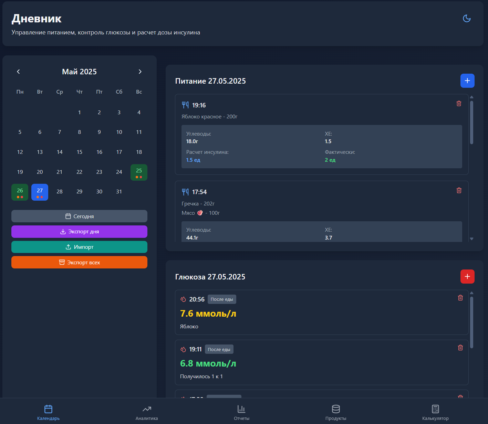
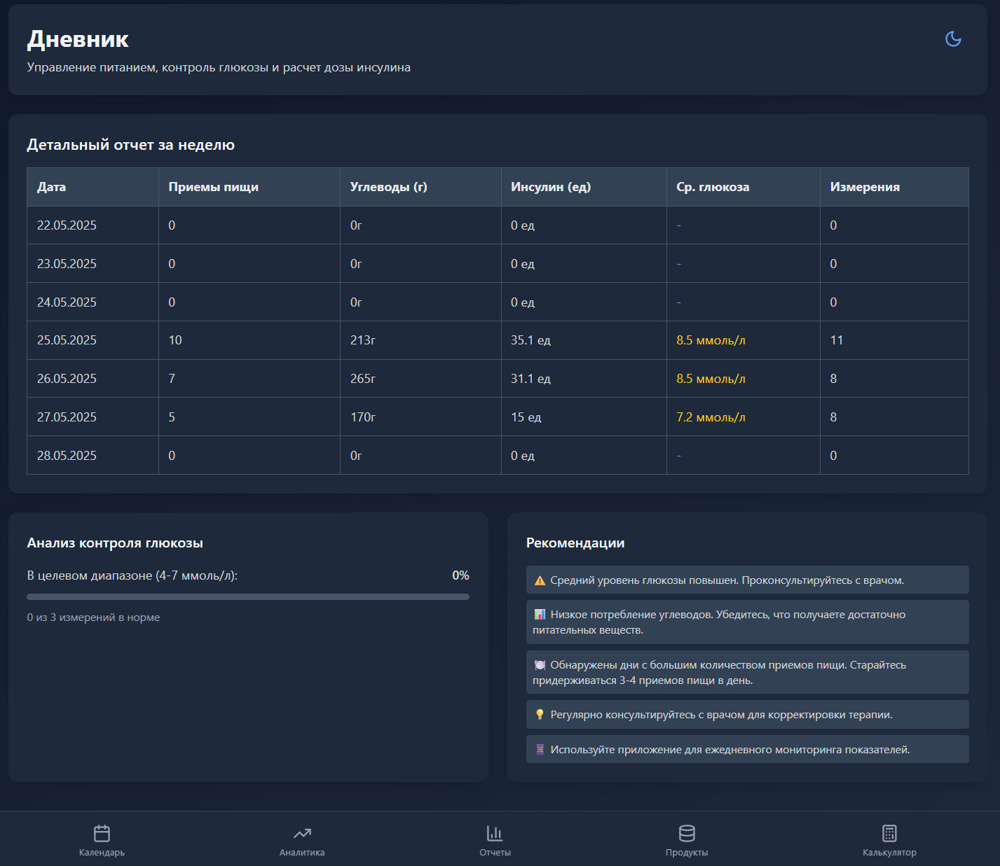
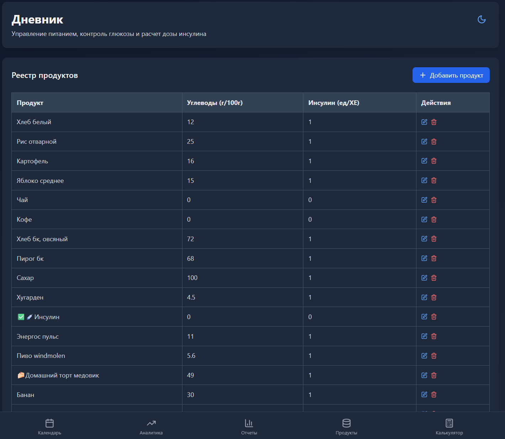
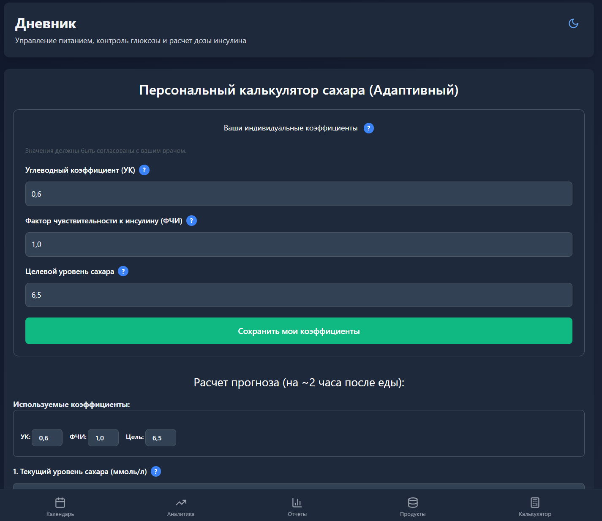

# Дневник самоконтроля при диабете

  

    

      
      
<em>Календарь с приёмами пищи и измерениями</em>

    

    

      
      
<em>Графики и аналитика показателей</em>

    

    

      
      
<em>Автоматические отчёты и рекомендации</em>

    

    

      
      
<em>Реестр продуктов с учётом углеводов</em>

    

    

      
      
<em>Калькулятор дозы инсулина и прогноза сахара</em>

    

  

> **Дневник диабетика** — это современное веб-приложение для ведения дневника самоконтроля при сахарном диабете: учёт питания, глюкозы, расчёт дозы инсулина и аналитика.

## Возможности

- 📅 Календарь с приёмами пищи и измерениями глюкозы
- 📊 Графики и аналитика за неделю и месяц
- 📝 Автоматические отчёты и рекомендации
- 🍏 Реестр продуктов с учётом углеводов и инсулина
- 🧮 Интерактивный калькулятор расчёта дозы инсулина и прогноза сахара
- 🤖 ИИ-помощник для прогнозирования уровня сахара
- 🌙 Поддержка светлой и тёмной темы
- 📱 Полная адаптивность для мобильных устройств

## Преимущества и дополнительные особенности

---

🎯 **Простота использования**  
Интуитивно понятный интерфейс с минималистичным дизайном, адаптированный для пользователей всех возрастов.

---

⚙️ **Персонализация**  
Возможность настройки индивидуальных коэффициентов (УК, ФЧИ, целевой уровень сахара) для точных расчетов.

---

🤖 **ИИ-помощник**  
Интеллектуальный анализ данных с использованием различных языковых моделей:
- Поддержка нескольких API (Gemini, DeepSeek, ChatGPT, OpenRouter, LM Studio)
- Выбор предпочтительной модели
- Прогноз уровня сахара на 2 часа вперед
- Учет активного инсулина и углеводов
- Автоматическое переключение между моделями при недоступности

---

📈 **Комплексный анализ**  
Автоматическое построение графиков и отчетов для:
- Динамики уровня сахара
- Потребления углеводов
- Использования инсулина

---

📱 **Мобильность**  
Полностью адаптивный интерфейс, работающий на любых устройствах - от смартфонов до компьютеров.

---

🔒 **Безопасность данных**  
Локальное хранение информации без передачи на серверы.

---

🍎 **Реестр продуктов**  
База данных с информацией о:
- Содержании углеводов
- Коэффициентах инсулина
- Возможностью добавления новых продуктов

---

💾 **Экспорт/импорт данных**  
Удобный перенос информации между устройствами в формате JSON.

---

🌍 **Мультиязычность**  
Поддержка русского языка с возможностью расширения на другие языки.

---

**Внимание!** Приложение не заменяет консультацию врача. Все расчёты и рекомендации носят справочный характер.